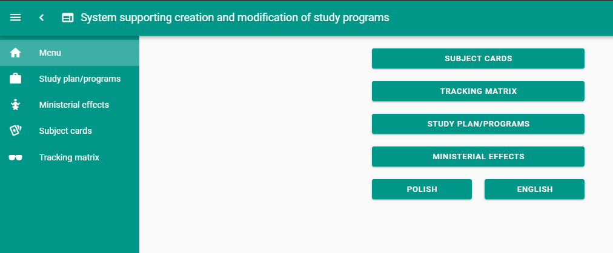
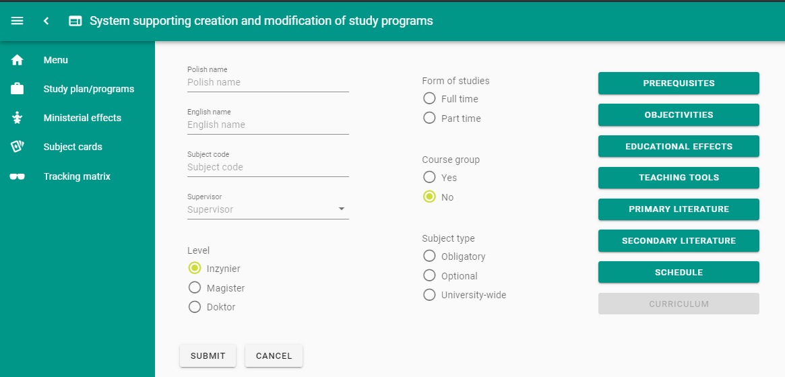
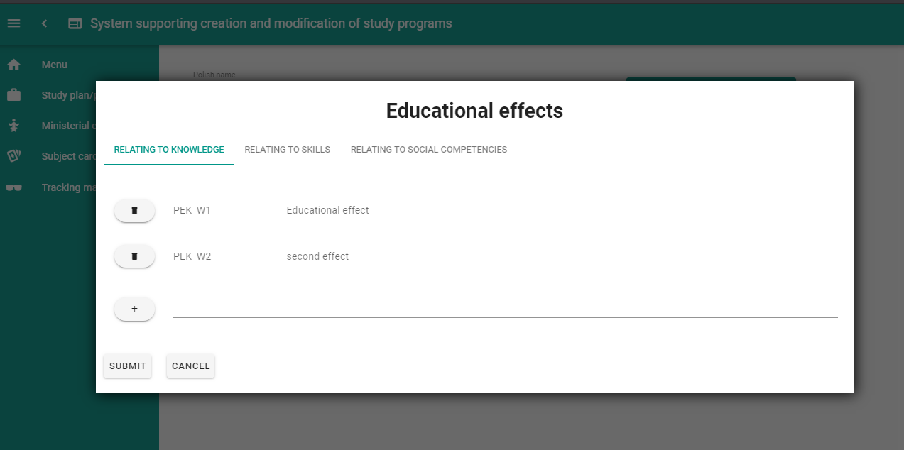
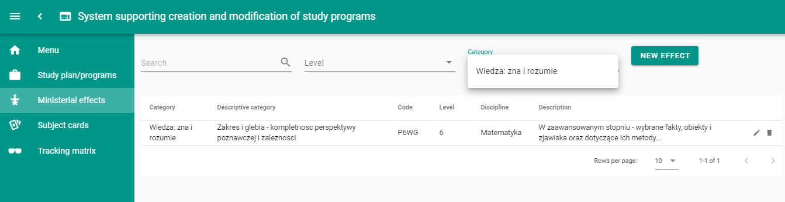

# SYLLABUS
Web application providing interface for creating subject cards and syllabus for unversity study programs.

## Used Technology Stack

**ASP.NET Core 3.0:**

* Web.API
* Vue CLI and JavaScript Services middlewares to integrate with client app

**Vue.js with CLI 4.0 supporting optional integrations:**

* TypeScript
* Progressive Web App
* Vue Router & Vuex (State Store)
* Linting, unit testing, E2E testing
* 3rd party component frameworks (Vuetify, Vue Bootstrap etc.)
* publish your personal/enterprise plugin and so on...

### Frontend:
- [Vuetify](https://vuetifyjs.com/) - Material Design component framework for Vue.js. It aims to provide all the tools necessary to create beautiful content rich applications
- [Vue I18n](https://kazupon.github.io/vue-i18n/) - internationalization plugin for Vue.js 

### Backend:
- [Entity Framework Core](https://docs.microsoft.com/en-us/ef/core/) - lightweight, extensible, and cross-platform version of the popular Entity Framework data access technology.
- [DinktToPdf](https://github.com/rdvojmoc/DinkToPdf) - .NET Core P/Invoke wrapper for wkhtmltopdf library that uses Webkit engine to convert HTML pages to PDF
- [Automapper](https://automapper.org/) - A convention-based object-object mapper.

### Infrastructure:
- [Docker](www.docker.com) - set of platform as a service (PaaS) products that use OS-level virtualization to deliver software in containers.
- [Docker compose](https://docs.docker.com/compose/) - tool for defining and running multi-container Docker applications.
- [Vagrant](www.vagrantup.com) - open-source software product for building and maintaining portable virtual software development environments.
- [Jenkins](https://jenkins.io/) - free and open source automation server.

## Features

* Hot module replacement
* Code-splitting
* Tree-shaking
* ES2017 transpilation
* Long term caching and so on

## Prerequisites

* [.NET Core](https://www.microsoft.com/net/download/windows) >= 3.0
* [NodeJS](https://nodejs.org/) >= 8.9
* [Vue CLI](https://cli.vuejs.org/) >= 4.0

## Before running application
### Initialize database
1. Set proper connection string in apsettings.Development.json file
2. Run `update-database` from package manager console (VS 2019) or `dotnet ef update-database` from cmd (VS Code)

## Run the application

You have two choices when it comes to how you prefer to run the app. You can either use the command line or the build-in run command.

### 1. Using the command line

* Run the .NET application using `dotnet run`

### 2. Using the built-in run command

* Run the application in VSCode or Visual Studio 2017 by hitting `F5`

> It will take some time during the first run to download all client side dependencies.

## View your application running

Browse to [http://localhost:5000](http://localhost:5001) for ASP.&#8203;NET Core + Vue app or browse to [http://localhost:8080](http://localhost:8080) for Vue app only.

Documentation available only in polish (see Docs folder)
